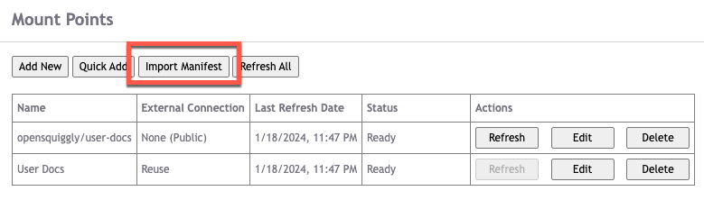

## Overview
Manually creating mount points through the User Options menu is fine when all you have
is a handful of mount points. Creating mount points interactively is a great way to
explore the system and decide which external sources are useful to your project and which
ones you don't need or want.

But sometimes you have a lot of repositories that you want to mount. It's not uncommon
for organizations to have hundreds, thousand, tens of thousands, or even hundreds of
thousands of repositories spread around the organization.

It would take far too much time to create these mount points one-by-one using the interactive
dialog. To solve this problem, OpenSquiggly offers manifest files which can import an
arbitrary number of mount points based on the definitions stored in a manifest file.

{{ $image := .Resources.GetMatch "./ManifestImport1.png" }}

