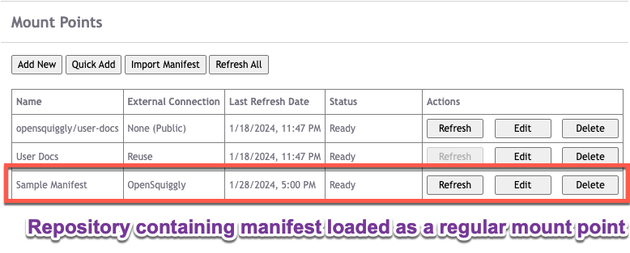
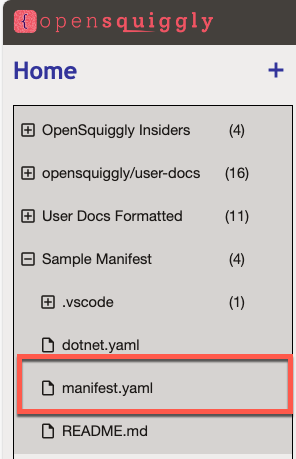
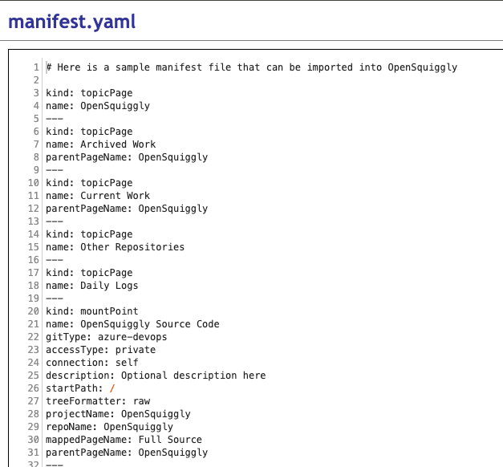
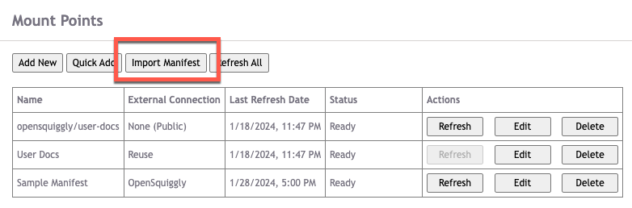
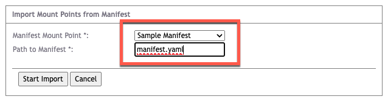

## Overview
Manually creating mount points through the User Options menu is fine when all you have
is a handful of mount points. Creating mount points interactively is a great way to
explore the system and decide which external sources are useful to your project and which
ones you don't need or want.

But sometimes you have a lot of repositories that you want to mount. It's not uncommon
for organizations to have hundreds, thousands, tens of thousands, or even hundreds of
thousands of repositories spread around the organization.

It would take far too much time to create these mount points one-by-one using the interactive
dialog. To solve this problem, OpenSquiggly offers manifest files which can import an
arbitrary number of mount points based on the definitions stored in a manifest file.

## Importing a Manifest File

The manifest file is itself delivered to OpenSquiggly via a mount point.

### Steps to Complete

1. Create a repository in a Git hosting system of your choice, and create a manifest file
   within that repository.
2. Mount the repository containing the manifest using the ordinary OpenSquiggly facitilites.  
   Example: 
   
    
   Manifest repository can contain one or more manifests.  
   
     
   Sample manifest file content:  
   
3. Your manifest should now be accessible to your OpenSquiggly instance and ready to import.
   Click the "Import Manifest" button in the Mount Points section of the User Options page.   
   
4. Select the Manifest Mount Point and enter the name of the manifest file you wish to import.
   
5. Click "Start Import" to start processing the manifest file. Processing will occur on the server
   and run in the background. You can perform other actions as the import runs.   
 

   
